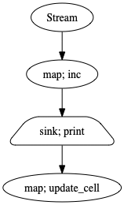

<p align="center">
    <a href="#readme">
        
    </a>
</p>

---

**water-healer**, Extension of Streamz to update Kafka consumer offset for every successful sink.

This library also added streaming metrics, auto-shutdown, auto-graceful, checkpointing and additional functions to stream pipeline.

## Table of contents

  * [Problem statement](#Problem-statement)
    * [update offset during sinking](#update-offset-during-sinking)
    * [update offset for distributed processing](#update-offset-for-distributed-processing)
  * [Installing from the PyPI](#Installing-from-the-PyPI)
  * [How-to](#how-to)
    * [update offset](#update-offset)
    * [streaming metrics](#streaming-metrics)
    * [auto shutdown](#auto-shutdown)
    * [auto graceful delete](#auto-graceful-delete)
    * [checkpointing](#checkpointing)
      * [disable checkpointing using OS environment](#disable-checkpointing-using-os-environment)
  * [Usage](#Usage)
    * [checker](#checker)
      * [check_leakage](#check_leakage)
    * [core](#extension)
      * [partition_time](#partition_time)
      * [foreach_map](#foreach_map)
      * [foreach_async](#foreach_async)
    * [healing](#healing)
      * [waterhealer.healing](#waterhealerhealing)
      * [waterhealer.healing_batch](#waterhealerhealing_batch)
    * [kafka](#kafka)
      * [waterhealer.from_kafka](#waterhealerfrom_kafka)
      * [waterhealer.from_kafka_batched](#waterhealerfrom_kafka_batched)
      * [waterhealer.from_kafka_batched_scatter](#waterhealerfrom_kafka_batched_scatter)
    * [plugin](#plugin)
      * [waterhealer.plugin.error_logging](#waterhealerpluginerror_logging)
    * [source](#source)
      * [waterhealer.metrics](#waterhealermetrics)
      * [waterhealer.auto_shutdown](#waterhealerauto_shutdown)
  * [Examples](#Examples)

## Problem statement

### update offset during sinking

Common Kafka consumer level developer use to `poll`, once it `poll`, consumer already updated offset for the topics whether the streaming successful or not, and we know, `processed-once` behavior of streaming processing. So if you stream a very important data related to finance or something like that, you wanted to reprocess that failed streaming.

Example,

```python
# assume we have a topic `test`.
# 1 partition, [1, 2, 3, 4, 5, 6]
# with first offset: 0
# with last offset: 3

# and we have a consumer group name, `group`.
# `group` offset: 0

# and we have a producer, initiated by debezium / confluent-kafka / kafka-python / etc.
producer = Producer()

from streamz import Stream
source = Stream.from_kafka(
    [
        'test'
    ],
    {
        'bootstrap.servers': 'localhost:9092',
        'group.id': 'group',
        'auto.offset.reset': 'earliest',
    },
)
```

I just want to do simple pipeline, each element in topic just plus by one.

```python

def plus_one(row):

    # a simple error to mimic programmer error
    if row > 3:
        raise Exception('row is bigger than 3!')
    return row + 1

source.map(json.loads).map(plus).sink(print)
```

During `poll`, 

```python

# remember our queue,    [  1,    2,    3,   4,   5,   6  ]
# offsets             -1    0     1     2    3    4    5
# when pulled at -1, we got element 1, pulled at 0 got element 2, and so on.

# start python script,
# `group` offset: -1

# every successful `poll`, it will automatically update the offset.

# first polling,
# `group` offset: 0
# kafka -> 1 -> plus_one(1) -> 2 -> print(2)

# second polling,
# `group` offset: 1
# kafka -> 2 -> plus_one(2) -> 3 -> print(3).

# third polling,
# `group` offset: 2
# kafka -> 3 -> plus_one(3) -> exception, halt

# fourth polling, restart python script,
# `group` offset: 3
# kafka -> 4 -> plus_one(4) -> exception, halt
```

Consumer already updated the offset even though the streaming is failed.

On fourth polling, we should pull back `offset` 2, not proceed 

### update offset for distributed processing

In a real world, some of realtime functions really took a long, maybe caused some long polling like merging data from database or waiting some events.

Let say we have a single stream and 3 workers can execute a function in parallel manner, the function simply like,

```python
def foo(x):
    # wait event, sometime x can caused very long waiting, sometime not
    return
```

Our stream with 3 offsets, FIFO,

```python
offsets = [1, 2, 3]
```

So `1` will go to first worker, `2` will go to second worker, and `3` will go to third worker. The execution time as below,

```text
first worker = return error, 5 seconds
second worker = return result, 2 seconds
third worker = return result, 1 second
```

The queue be like, FIFO,

```python
queue = [3, 2, 1]
```

Offset `3` comes first, but the problem here, offset `1` got error and we don't want to simply update offset `3` because it came first, we want to reprocess from offset `1`.

So, water-healer will wait offset `1` first, after that will execute offset `2` and `3`.

Or maybe this google slide can help you to understand more about water healer, [link to slide](https://docs.google.com/presentation/d/1ixiFIfcnVajMK8L6lY2hG_X5vipQ3gRk_ZsFjuXCWEY/edit?usp=sharing).

## Installing from the PyPI

```bash
pip install water-healer
```

## How-to

### update offset

To understand technically of update offset, simply can read at [Problem statement](#Problem-statement)

```python
import waterhealer as wh

# subscribe to `testing` topic
source = wh.from_kafka(
    ['testing'],
    {
        'bootstrap.servers': 'localhost:9092',
        'group.id': 'group',
        'auto.offset.reset': 'latest',
    })

source.sink(wh.healing, source = source)
```

We need to use `waterhealer.from_kafka` for streaming source, and use `waterhealer.healing` for sinking or mapping process.

Simply can read more about [waterhealer.from_kafka](#waterhealerfrom_kafka) and [waterhealer.healing](#waterhealerhealing)

### streaming metrics

Now we have a simple streaming,

```python
from time import sleep, time
from streamz import Stream

def inc(x):
    sleep(1)
    return x + 1

source = Stream()
source.map(inc).sink(print)
```



I want to know for each map / sink functions,

1. input rate
2. output rate
3. time execution
4. input data size
5. output data size

To enable this metrics, simply,

```python
import waterhealer as wh
source = wh.metrics(source = source)
```

And we can start simply start `emit` or use any async sources like `from_kafka`. By default, it will create prometheus exporter at port 8000, [localhost:8000](http://localhost:8000)

The definition of prometheus metrics,

```python
f = function_name
Counter(f'total_before_{f}', f'total input {f}')
Counter(f'total_after_{f}', f'total output {f}')
total_error = Counter(f'total_error_{f}', f'total total {f}')
total_time = Summary(
    f'total_time_{f}', f'summary of time execution {f}'
)
total_time_histogram = Histogram(
    f'total_time_histogram_{f}',
    f'histogram of time execution {f}',
)
data_size_before = Summary(
    f'data_size_before_{f}',
    f'summary of input data size {f} (KB)',
)
data_size_after = Summary(
    f'data_size_after_{f}',
    f'summary of output data size {f} (KB)',
)
data_size_before_histogram = Histogram(
    f'data_size_before_histogram_{f}',
    f'histogram of input data size {f} (KB)',
)
data_size_after_histogram = Histogram(
    f'total_time_after_histogram_{f}',
    f'histogram of output data size {f} (KB)',
)
```

If you check [localhost:8000](http://localhost:8000),

```text
total_time_source__inc_count 1.0
total_time_source__inc__print_count 1.0
```

`source__inc`, as definition source -> inc() .

`source__inc__print`, as definition source -> inc() -> print() .

We use `sys.getsizeof` to calculate data size, so, we might expect some headcost. By default metrics for time execution and data size will enable, to disable it, simply check [waterhealer.metrics](#waterhealermetrics).

### auto shutdown

Problem with streamz, it run everything in asynchronous manner, so it is very hard to make our Streamz script auto restart if got unproper exception handling. To make it auto restart if python script shutdown, you can run it in kubernetes or any auto restart program after use this interface.

```python
from time import sleep, time
from streamz import Stream
import waterhealer as wh

def inc(x):
    sleep(1)
    return x + 1

source = Stream()
source.map(inc).sink(print)
wh.auto_shutdown(source, got_error = True)
```

`wh.auto_shutdown` will wait event loop to close, if closed, halt python script.

### auto graceful delete

We also want to Streamz script auto delete itself if no update offset after N seconds. This only work if we added `wh.healing` in our streaming. To make it auto restart if python script shutdown, you can run it in kubernetes or any auto restart program after use this interface.

```python
from time import sleep, time
from streamz import Stream
import waterhealer as wh

def inc(x):
    sleep(1)
    return x + 1

source = Stream()
source.map(inc).sink(wh.healing, source = source)
wh.auto_shutdown(source, graceful = 5400)
```

`wh.auto_shutdown(source, graceful = 5400)` will shutdown after 5400 seconds if no update offset after 5400 seconds. To disable it, simply `wh.auto_shutdown(source, graceful = 0)`.

### auto shutdown dask

When dask client disconnected with dask cluster, `wh.auto_shutdown` also can helps us to shutdown the script.

```python
client = Client()
wh.auto_shutdown(source, graceful = 5400, client = client)
```

### checkpointing

Let say every emit, I want to store value from each nodes returned, example as,


Checkpointing is really good for debugging purpose especially if we use dask to do distributed processing, so to enable checkpointing, simply,

```python
import waterhealer as wh
from waterhealer import Stream

def increment(x):
    return x + 1

def increment_plus2(x):
    return x + 2

source = Stream()
source.map(increment, checkpoint = True).map(increment_plus2, checkpoint = True).sink(print)
source.emit(1)
print(source.checkpoint)
```

Output is,

```python
{'Stream.map.increment': 2, 'Stream.map.increment.map.increment_plus2': 4}
```

Checkpointing also can put on `zip`, `sink`, and other interfaces.

Check more extensive example including Dask checkpointing on [dask-checkpointing.ipynb](example/dask-checkpointing.ipynb).

#### disable checkpointing using OS environment

Incase we are so lazy to remove `checkpoint = True`, we can disable checkpointing using OS environment, by simply set,

```bash
export DISABLE_CHECKPOINTING=true
```

Or pythonic way,

```bash
import os
os.environ['DISABLE_CHECKPOINTING'] = 'true'
```

## Usage

### checker

#### check_leakage

A decorator to check UUID leakage in before and after UUIDs.

```python
@check_leakage
def func(rows):
    # do something cause after uuid not same as before uuid
```

### core

* [partition_time](#partition_time)
* [foreach_map](#foreach_map)
* [foreach_async](#foreach_async)

#### partition_time

```python
class partition_time(Stream):
    """ Partition stream into tuples if waiting time expired.

    Examples
    --------
    >>> source = Stream()
    >>> source.partition_time(3).sink(print)
    >>> for i in range(10):
    ...     source.emit(i)
    (0, 1, 2)
    (3, 4, 5)
    (6, 7, 8)
    """
```

This is different from [partition](https://streamz.readthedocs.io/en/latest/api.html#streamz.partition).

`partition` only proceed to next flow if size is equal to `n`. But for `partition_time`, if waiting time is expired, it will proceed, does not care about the size, and expired time only calculated when an element came in.

#### foreach_map

```python
class foreach_map(Stream):
    """ Apply a function to every element in a tuple in the stream
    Parameters
    ----------
    func: callable
    *args :
        The arguments to pass to the function.
    **kwargs:
        Keyword arguments to pass to func
    Examples
    --------
    >>> source = Stream()
    >>> source.foreach_map(lambda x: 2*x).sink(print)
    >>> for i in range(3):
    ...     source.emit((i, i))
    (0, 0)
    (2, 2)
    (4, 4)
    """
```

It is like `map`, but do `map` for each elements in a batch in sequential manner.

#### foreach_async

```python
class foreach_async(Stream):
    """ 
    Apply a function to every element in a tuple in the stream, in async manner.

    Parameters
    ----------
    func: callable
    *args :
        The arguments to pass to the function.
    **kwargs:
        Keyword arguments to pass to func

    Examples
    --------
    >>> source = Stream()
    >>> source.foreach_async(lambda x: 2*x).sink(print)
    >>> for i in range(3):
    ...     source.emit((i, i))
    (0, 0)
    (2, 2)
    (4, 4)
    """
```

It is like `map`, but do `map` for each elements in a batch in async manner.

Partial code can be like this,

```python
.map(function).partition(5).partition(5).foreach_async(wh.healing_batch, stream = source)
```

Example, [simple-plus-nested-batch.ipynb](example/simple-plus-nested-batch.ipynb)

### kafka

* [waterhealer.from_kafka](#waterhealerfrom_kafka)
* [waterhealer.from_kafka_batched](#waterhealerfrom_kafka_batched)

#### waterhealer.from_kafka

```python
class from_kafka(Source):
    """

    Parameters
    ----------
    topics: list of str
        Labels of Kafka topics to consume from
    consumer_params: dict
        Settings to set up the stream, see
        https://docs.confluent.io/current/clients/confluent-kafka-python/#configuration
        https://github.com/edenhill/librdkafka/blob/master/CONFIGURATION.md
        Examples:
        bootstrap.servers, Connection string(s) (host:port) by which to reach
        Kafka;
        group.id, Identity of the consumer. If multiple sources share the same
        group, each message will be passed to only one of them.
    poll_interval: number
        Seconds that elapse between polling Kafka for new messages
    start: bool, (default=False)
        Whether to start polling upon instantiation
    debug: bool, (default=False)
        If True, will print topic, partition and offset for each polled message.
    maxlen_memory: int, (default=10000)
        max length of topic and partition dictionary for healing process.
    maxage_memory: int, (default=3600)
        max age for a partition stay in topic and partition dictionary.
    """
```

`waterhealer.from_kafka` always returned a tuple,

```python
(uuid, value)
```

Data structure of uuid,

```python
{
    'partition': partition,
    'offset': offset,
    'topic': topic,
}
```

If you want to use waterhealer, you need to make sure `uuid` from `from_kafka` succesfully transported until healing, or else it cannot update the offset.

**Output from `waterhealer.from_kafka` is different from any sources object from `streamz`, `streamz` only returned `value`, not tuple as `waterhealer.from_kafka`.**

#### waterhealer.from_kafka_batched

```python
class from_kafka_batched(Source):
    """

    Parameters
    ----------
    topics: list of str
        Labels of Kafka topics to consume from
    consumer_params: dict
        Settings to set up the stream, see
        https://docs.confluent.io/current/clients/confluent-kafka-python/#configuration
        https://github.com/edenhill/librdkafka/blob/master/CONFIGURATION.md
        Examples:
        bootstrap.servers, Connection string(s) (host:port) by which to reach
        Kafka;
        group.id, Identity of the consumer. If multiple sources share the same
        group, each message will be passed to only one of them.
    batch_size: int
        batch size of polling
    batch_timeout: number
        timeout for batching if not reach size `batch_size`
    poll_interval: number
        Seconds that elapse between polling Kafka for new messages
    start: bool, (default=False)
        Whether to start polling upon instantiation
    debug: bool, (default=False)
        If True, will print topic, partition and offset for each polled message.
    maxlen_memory: int, (default=10_000_000)
        max length of topic and partition dictionary for healing process.
    maxage_memory: int, (default=3600)
        max age for a partition stay in topic and partition dictionary.
    """
```

Same as `waterhealer.from_kafka`, but we pulled partitions in parallel manners.

Example, [kafka-batch-dask-simple-plus-batch.ipynb](example/kafka-batch-dask-simple-plus-batch.ipynb)

#### water.from_kafka_batched_scatter

```python
def from_kafka_batched_scatter(
    topics,
    consumer_params,
    poll_interval = 10,
    batch_size = 1000,
    maxlen_memory = 10_000_000,
    maxage_memory = 3600,
    dask = False,
    **kwargs,
):
    """

    Parameters
    ----------
    topics: list of str
        Labels of Kafka topics to consume from
    consumer_params: dict
        Settings to set up the stream, see
        https://docs.confluent.io/current/clients/confluent-kafka-python/#configuration
        https://github.com/edenhill/librdkafka/blob/master/CONFIGURATION.md
        Examples:
        bootstrap.servers, Connection string(s) (host:port) by which to reach
        Kafka;
        group.id, Identity of the consumer. If multiple sources share the same
        group, each message will be passed to only one of them.
    batch_size: int
        batch size of polling
    poll_interval: number
        Seconds that elapse between polling Kafka for new messages
    maxlen_memory: int, (default=10_000_000)
        max length of topic and partition dictionary for healing process.
    maxage_memory: int, (default=3600)
        max age for a partition stay in topic and partition dictionary.
    dask_bootstrap: str, (default=None)
        dask bootstrap, will automatically scatter the offsets if provided the bootstrap.
    """
```

### healing

* [waterhealer.healing](#waterhealerhealing)
* [waterhealer.healing_batch](#waterhealerhealing_batch)

#### waterhealer.healing

```python
def healing(
    row: Tuple,
    source: Callable = None,
    ignore: bool = False,
    asynchronous: bool = True,
    interval: int = 10,
):
    """

    Parameters
    ----------
    row: tuple
        (uuid, value)
    source: waterhealer object
        waterhealer object to connect with kafka.
    ignore: bool, (default=False)
        if True, ignore any failed update offset.
    asynchronous: bool, (default=True)
        if True, it will update kafka offset async manner.
    interval: int, (default=10)
        Every interval, will update batch of kafka offsets. Set 0 to update every healing process.
    """
```

Partial code can be like this,

```python
.map(function).sink(healing, source = source)
```

This function will returned,

```python
return {
    'data': row[1],
    'success': success,
    'reason': reason,
    'partition': partition,
    'offset': offset,
    'topic': topic,
}
```

Example, [simple-plus-element.ipynb](example/simple-plus-element.ipynb)

#### waterhealer.healing_batch

Instead we do it one-by-one, we can do concurrent updates async manner.

```python
def healing_batch(
    rows: Tuple[Tuple],
    source: Callable = None,
    ignore: bool = False,
    asynchronous: bool = True,
):
    """

    Parameters
    ----------
    row: tuple of tuple
        ((uuid, value),)
    source: waterhealer object
        waterhealer object to connect with kafka
    ignore: bool, (default=False)
        if True, ignore any failed update offset.
    asynchronous: bool, (default=True)
        if True, it will update kafka offset async manner.
    """
```

Partial code can be like this,

```python
.map(function).partition(5).sink(healing_batch, source = source)
```

This function will returned,

```python
return [{
    'data': row[1],
    'success': success,
    'reason': reason,
    'partition': partition,
    'offset': offset,
    'topic': topic,
},
{
    'data': row[1],
    'success': success,
    'reason': reason,
    'partition': partition,
    'offset': offset,
    'topic': topic,
}]
```

A list of results `waterhealer.healing`.

Example, [simple-plus-batch.ipynb](example/simple-plus-batch.ipynb)

### source

* [waterhealer.metrics](#waterhealermetrics)
* [waterhealer.auto_shutdown](#waterhealerauto_shutdown)

#### waterhealer.metrics

```python
def metrics(
    source,
    time_execution_metrics: bool = True,
    data_size_metrics: bool = True,
    port: int = 8000,
):
    """

    Parameters
    ----------
    source: source object
        streamz source.
    time_execution_metrics: bool, (default=True)
        added time execution metrics.
    data_size_metrics: bool, (default=True)
        data size metrics.
    port: int, (default=8000)
        default port for prometheus exporter.
        
    """
```

#### waterhealer.auto_shutdown

```python
def auto_shutdown(
    source,
    got_error: bool = True,
    got_dask: bool = True,
    graceful_offset: int = 3600,
    graceful_polling: int = 1800,
    interval: int = 5,
    sleep_before_shutdown: int = 2,
    logging: bool = False,
):
    """

    Parameters
    ----------
    source: source object
        async streamz source.
    got_error: bool, (default=True)
        if dask streaming got an exception, automatically shutdown the script.
    got_dask: bool, (default=True)
        if True, will check Dask status, will shutdown if client status not in ('running','closing','connecting','newly-created').
    graceful_offset: int, (default=3600)
        automatically shutdown the script if water-healer not updated any offsets after `graceful_offset` period. 
        To off it, set it to 0.
    graceful_polling: int, (default=1800)
        automatically shutdown the script if kafka consumer not polling after `graceful_polling` period. 
        To off it, set it to 0.
    interval: int, (default=5)
        check heartbeat every `interval`. 
    sleep_before_shutdown: int, (defaut=2)
        sleep (second) before shutdown.
    logging: bool, (default=False)
        If True, will print logging.error if got any error, else, print
    """
```

## Examples

For more complicated example, simply check notebooks in [example](example).